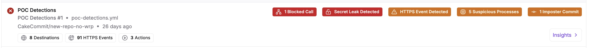
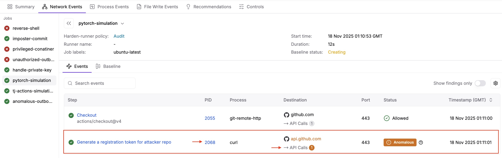
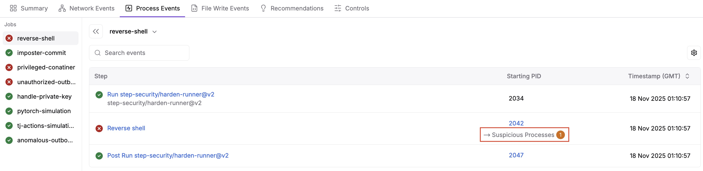
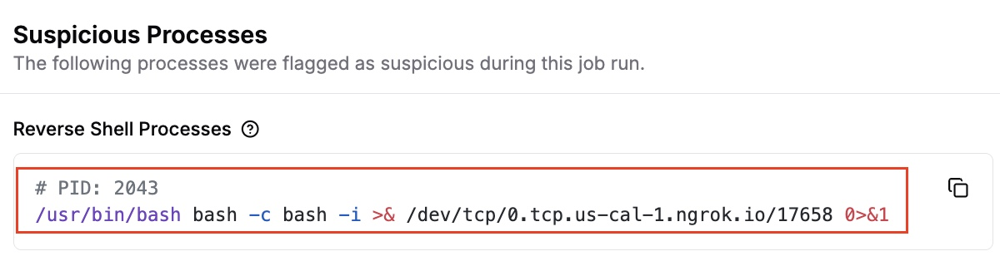
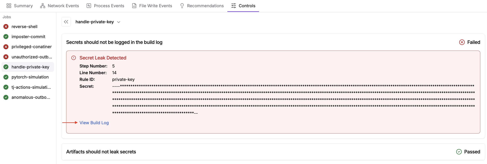

# Harden-Runner POC Detections
 
Harden-Runner is a purpose-built network filtering and runtime security monitoring platform for CI/CD runners. To learn more about Harden-Runner functionality, see [here](https://docs.stepsecurity.io/harden-runner)

This repository contains the workflow file `POC-detections-gh-hosted.yml` that contains several different jobs to trigger all Harden-Runner detections, which include: 

| Detections | Description |
|------------|-------|
| **Secrets in Build Logs** | Detects secrets (API keys, tokens, etc.) that were accidentally leakd in build logs |
| **Secrets in Artifacts** |  Detects secrets found in generated artifacts |
| **Outbound Calls Blocked** | Blocks outbound network requests to prevent security risks |
| **Anomalous Outbound Network Calls** | Detects anomalous or unexpected external network requests |
| **Suspicious Outbound Network Calls** | Detects potentially malicious network requests during workflow execution |
| **Source Code Overwritten** | Detect files modified during workflows to detect unauthorized changes |
| **HTTPS Outbound Network Calls** | Monitors for API calls that contain data-exfiltration signals - specifically, POST, PUT, or PATCH requests going outside of the organization where the workflow resides |
| **Action Uses Imposter Commit** | Monitors for Actions using tags that are pointed to malicious commits - commits that do not exist in the actions repository or are pointed to a fork. A technique that is used to evade code detection |
| **Reverse Shell** | Monitors for reverse shell activity. An attacker establishing a reverse shell can potentially run commands, exfiltrate data, and move laterally |
| **Privileged Container** | Monitors for priviledged container scenarios. A priviledged container process can give an attacker the ability to escape the container and access host resources, exfiltrate data, and move laterally |
| **Runner Worker Memory Read** | Monitors for attempts to read runner.worker process memory. Compromises like TJ-Actions rely on accessing runner worker memory to extract secrets |

## Prerequisites
* Ensure you have installed the [StepSecurity GitHub App](https://github.com/apps/stepsecurity-actions-security) and have access to your StepSecurity dashboard
  
## Environment setup and information 
* You can fork this repository or simply copy the workflow file (`POC-detections-gh-hosted.yml`) into your own organization for testing. The workflow files use GitHub hosted runners with Harden-Runner deployed on the jobs. For Self-Hosted scenario, please [reach out to StepSecurity](https://www.stepsecurity.io/contact).
* This workflow uses a workflow_dispatch trigger, meaning the workflows can be triggered manually from the Actions tab by selecting the workflow and clicking **Run workflow**
* Most detections do not require a baseline to be established and will be triggered upon running the [POC Detections workflow](https://github.com/step-security-poc/stepsecurity-poc-harden-runner/blob/main/.github/workflows/POC-detections-gh-hosted.yml) file one time
* To detect and block *anomalous network calls*, a baseline is required to be established. For testing purposes, it is recommended to reduce the minimum number of runs from the default (100) to 1
  * This can be done under your dashboard: `Admin Console -> Settings -> Anomaly Detection` - set this as '1' and **save changes**

## Triggering detections not requiring a baseline
The following detections will trigger as soon as you run the `POC-detections-gh-hosted.yml` workflow one time:

* HTTPS Monitoring for Anomalous Network Calls (**Network** Event Detection)
* Reverse Shell (**Process** Event Detection) 
* Privileged Container (**Process** Event Detection) 
* Runner Worker Memory Read (**Process** Event Detection) 
* Imposter Commit (**Process** Event Detection)
* Secrets in Build Logs (**Control** Detection)

### Viewing detections not requiring a baseline

Navigate to your StepSecurity dashboard. Under **Harden-Runner → Workflow Runs** select the workflow run which you ran in the step above and select **Insights**



For **Network Event Detections**, select the **Network Events** tab. Browse through the jobs to see which ones triggered detections. This workflow will trigger an anomalous network call via HTTPS Monitoring for the **pytorch-simulation** job. 


* *Click on **API Calls** to view details*
* *Click on the Process ID (**PID**) to pinpoint the exact process triggering this network call*

For **Process Event Detections**, select the **Process Events** tab. Browse through the jobs to see which ones triggered detections. This workflow triggers several process events for the following jobs: *reverse-shell*, *priviledged-container*, *imposter-commit*, *tj-actions-simulation*. The screenshot below shows an example for the reverse shell detection


*Click on **Suspicious Processes** to see details*


For **Secret Detections**, select the **Controls** tab. Any secrets in build logs or artifacts will show here. This workflow includes a leaked secret in the build logs for the *handle-private-key* job. 

*Click on *View Build Log* to see details on where this secret was leaked*


## Triggering detections requiring a baseline
After a baseline is established, Harden Runner can **audit or block** any new, anomalous network calls that are outside of the baseline. The baseline is [configurable](https://docs.stepsecurity.io/admin-console/settings/anomaly-detection#configuration) by number of job runs required, or by number of days elapsed. You can find this in your tenant dashboard under `Admin Console -> Settings -> Anomaly Detection`. While the default is 100, it is recommended to lower this for easier testing purpose. 

* Run the workflow based on the number of runs set above to generate a baseline. You can verify the baseline is stable under the `Harden-Runner -> Baseline` tab
* Run the workflow one more time, this time entering a new domain. (`Actions tab -> POC Detections` and before running the workflow, enter a new domain, ie `https://www.pastebin.com`)
* Since this new domain is now outside of the baseline, it will trigger an anomalous network call - to observe the anomalous network call, navigate to the workflow runs insights page under the Network Events tab
* Block Policy - [this section is currently being updated]

## Lockdown Mode (Kubernetes ARC deployments only) 

For **self-hosted ARC (Actions Runner Controller) deployments**, StepSecurity supports **Lockdown Mode** - which provides automatic blocking of CI/CD jobs when critical security threats are detected in real-time. Currently the following process detections are supported: 
| Detection | Description | 
|----------|----------|
| Reverse-Shell   | Blocks reverse shell connection attempts   | 
| Priviledged-Container   | Blocks containers running with elevated privileges   | 
| Runner-Worker-Memory-Read    | Blocks unauthorized memory reading attempts   | 

### Prerequisites

Before testing Lockdown Mode, you must have the ARC Harden-Runner agent installed in your Kubernetes cluster. To enable access to the ARC installation instructions:

1. Contact StepSecurity to activate ARC installation for your tenant.
2. Once enabled, navigate to: **Settings → Harden Runner Installation → ARC**
3. Follow the provided steps to deploy the Harden-Runner agent.

Finally, ensure that the Lockdown Mode workflows `lock-down-[process event type].yml` use the correct runner label

### Set up Lockdown Mode policy

To set up a Lockdown Mode Policy:
1. Navigate to the Policy Store tab (**Harden Runner → Policy Store**) and create a new policy, or edit an existing one
2. Add the lockdown configuration using the following syntax:
  ```
  lockdown-mode:
   enabled: true
   detections:
     - Privileged-Container
     - Runner-Worker-Memory-Read
     - Reverse-Shell
  ```
3. **Attach** the policy to your desired scope: cluster, organization, repository, or workflow
4. Trigger one of the three available Lockdown test workflows, for example `lock-down-reverse-shell.yml` via the Actions tab. This will trigger detections for these process events. When a threat is detected, the job will be immediately terminated and you will receive a notification with details about the blocked threat
